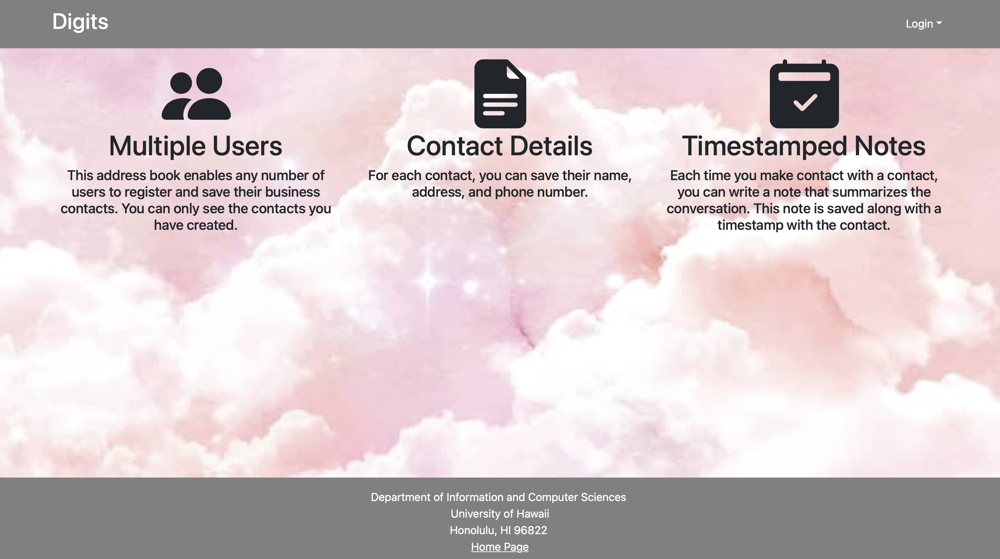

Digits is a sample Meteor 2.9 application that illustrates:

A standard directory layout using 'imports/' as recommended in the Meteor Guide
Bootstrap 5 React for user interface.
Uniforms for form development.
alanning:roles to implement a special "Admin" user.
Authorization, authentication, and registration using built-in Meteor packages.
Initialization of users and data from a settings file.
Alerts regarding success or failure of DB updates using Sweet Alert.
Quality assurance using ESLint with packages to partially enforce the Meteor Coding Standards and the AirBnB Javascript Style Guide.
The goal of this template is to help you get quickly started doing Meteor development by providing a reasonable directory structure for development and deployment, a set of common extensions to the core framework, and boilerplate code to implement basic page display, navigation, forms, roles, and collection manipulation.

To keep this codebase simple and small, some important capabilities are intentionally excluded from this template:

Unit Testing.
Security (digits enables the insecure packages)
Deployment
Examples of the these capabilities will be provided elsewhere.

Installation
First, install Meteor.

Second, on this templates repository, click the "Use this template" button. Complete the dialog box to create a new repository that you own that is initialized with this template's files.

Third, go to your newly created repository, and click the "Clone or download" button to download your new GitHub repo to your local file system. Using GitHub Desktop is a great choice if you use MacOS or Windows.

Fourth, cd into the app/ directory of your local copy of the repo, and install third party libraries with:

$ meteor npm install
Running the system
Once the libraries are installed, you can run the application by invoking the "start" script in the package.json file:

$ meteor npm run start
The first time you run the app, it will create some default users and data. Here is the output:

meteor npm run start

> meteor-application-template-react@ start /Users/carletonmoore/GitHub/ICS314/meteor-application-template-react/app
> meteor --no-release-check --exclude-archs web.browser.legacy,web.cordova --settings ../config/settings.development.json

[[[[[ ~/GitHub/ICS314/meteor-application-template-react/app ]]]]]

=> Started proxy.                             
=> Started HMR server.                        
=> Started MongoDB.                           
I20220529-12:09:18.384(-10)? Creating the default user(s)
I20220529-12:09:18.389(-10)?   Creating user admin@foo.com.
I20220529-12:09:18.453(-10)?   Creating user john@foo.com.
I20220529-12:09:18.515(-10)? Creating default data.
I20220529-12:09:18.515(-10)?   Adding: Basket (john@foo.com)
I20220529-12:09:18.599(-10)?   Adding: Bicycle (john@foo.com)
I20220529-12:09:18.600(-10)?   Adding: Banana (admin@foo.com)
I20220529-12:09:18.601(-10)?   Adding: Boogie Board (admin@foo.com)
I20220529-12:09:18.773(-10)? Monti APM: completed instrumenting the app
=> Started your app.

=> App running at: http://localhost:3000/
Periodically, you might see Error starting Mongo (2 tries left): Cannot run replSetReconfig because the node is currently updating its configuration after the => Started HMR server.. It doesn't seem to be a problem since the MongoDB does start.

Viewing the running app
If all goes well, the template application will appear at http://localhost:3000. You can login using the credentials in settings.development.json, or else register a new account.

ESLint
You can verify that the code obeys our coding standards by running ESLint over the code in the imports/ directory with:

meteor npm run lint
Walkthrough
The following sections describe the major features of this template.

Directory structure
The top-level directory structure is:

.github     # holds the GitHub Continuous Integration action and Issue template.
app/        # holds the Meteor application sources
config/     # holds configuration files, such as settings.development.json
doc/        # holds developer documentation, user guides, etc.
.gitignore  # don't commit IntelliJ project files, node_modules, and settings.production.json
This structure separates documentation files (such as screenshots) and configuration files (such as the settings files) from the actual Meteor application.

The app/ directory has this structure:

.deploy/
.gitignore     # don't commit mup.js or settings.json
mup.sample.js  # sample mup.js file used for deploying the application
settings.sample.json # sample settings file

client/
main.html      # The boilerplate HTML with a "root" div to be manipulated by React.
main.js        # import startup files.

imports/
api/           # Define collections
stuff/       # The Stuffs collection definition
startup/       # Define code to run when system starts up (client-only, server-only, both)
client/
server/
ui/
components/  # Contains page elements, some of which could appear on multiple pages.
layouts/     # Contains top-level layout (<App> component).
pages/       # Contains components for each page.

node_modules/    # managed by npm

public/          # static assets (like images) can go here.

server/
main.js       # import the server-side js files.

tests/           # testcafe acceptance tests.
Import conventions
This system adheres to the Meteor guideline of putting all application code in the imports/ directory, and using client/main.js and server/main.js to import the code appropriate for the client and server in an appropriate order.

Application functionality
The application implements a simple CRUD application for managing "Stuff", which is a Mongo Collection consisting of a name (String), a quantity (Number), a condition (one of 'excellent', 'good', 'fair', or 'poor') and an owner.

By default, each user only sees the Stuff that they have created. However, the settings file enables you to define default accounts. If you define a user with the role "admin", then that user gets access to a special page which lists all the Stuff defined by all users.

Landing page
When you retrieve the app at http://localhost:3000, this is what should be displayed:

The next step is to use the Login menu to either Login to an existing account or register a new account.

Login page
Clicking on the Login link, then on the Sign In menu item displays this page:

Register page
Alternatively, clicking on the Login link, then on the Sign Up menu item displays this page:

Landing (after Login) page, non-Admin user
Once you log in (either to an existing account or by creating a new one), the navbar changes as follows:

You can now add new Contacts or Notes, and list the Contacts you have created. Note you cannot see any Contacts created by other users.

Add Contacts page
After logging in, here is the page that allows you to add new Stuff:

List Contacts page
After logging in, here is the page that allows you to list all the Stuff you have created:

You click the "Edit" link to go to the Edit Stuff page, shown next.

Edit Contacts page
After clicking on the "Edit" link associated with an item, this page displays that allows you to change and save it:

Landing (after Login), Admin user
You can define an "admin" user in the settings.json file. This user, after logging in, gets a special entry in the navbar:

Admin page (list all users Contacts and Notes)
To provide a simple example of a "super power" for Admin users, the Admin page lists all of the Stuff by all of the users:

Note that non-admin users cannot get to this page, even if they type in the URL by hand.

Collections
The application implements a single Collection called "Contacts". Each Contacts document has the following fields: lastName, firstName, address, image, and description.

The Contacts collection is defined in imports/api/contact/contact.js.

The Contacts collection is initialized in imports/startup/server/Mongo.js.

CSS
The application uses the React implementation of Bootstrap 5. You can adjust the theme by editing the app/client/style.css file. To change the theme override the Bootstrap 5 CSS variables.

/* Change bootstrap variable values.
See https://getbootstrap.com/docs/5.2/customize/css-variables/
*/
body {
--bs-light-rgb: 236, 236, 236;
}

/* Define custom styles */
.gray-background {
background-color: var(--bs-gray-200);
color: var(--bs-dark);
padding-top: 10px;
padding-bottom: 20px;
}
Routing
For display and navigation among its four pages, the application uses React Router.

Routing is defined in imports/ui/layouts/App.jsx.

Authentication
For authentication, the application uses the Meteor accounts package.

When the application is run for the first time, a settings file (such as config/settings.development.json) should be passed to Meteor. That will lead to a default account being created through the code in imports/startup/server/accounts.js.

The application allows users to register and create new accounts at any time.

Authorization
Only logged in users can manipulate Stuff documents (but any registered user can manipulate any Stuff document, even if they weren't the user that created it.)

Configuration
The config directory is intended to hold settings files. The repository contains one file: config/settings.development.json.

The .gitignore file prevents a file named settings.production.json from being committed to the repository. So, if you are deploying the application, you can put settings in a file named settings.production.json and it will not be committed.

Quality Assurance
ESLint
The application includes a .eslintrc file to define the coding style adhered to in this application. You can invoke ESLint from the command line as follows:

[~/digits/app]-> meteor npm run lint

It's significantly easier to do development with ESLint integrated directly into your IDE (such as IntelliJ).
